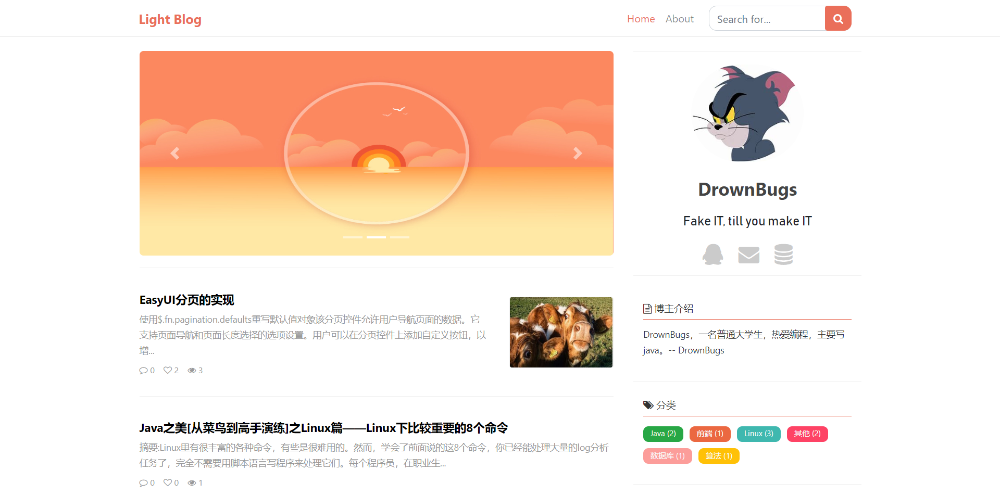
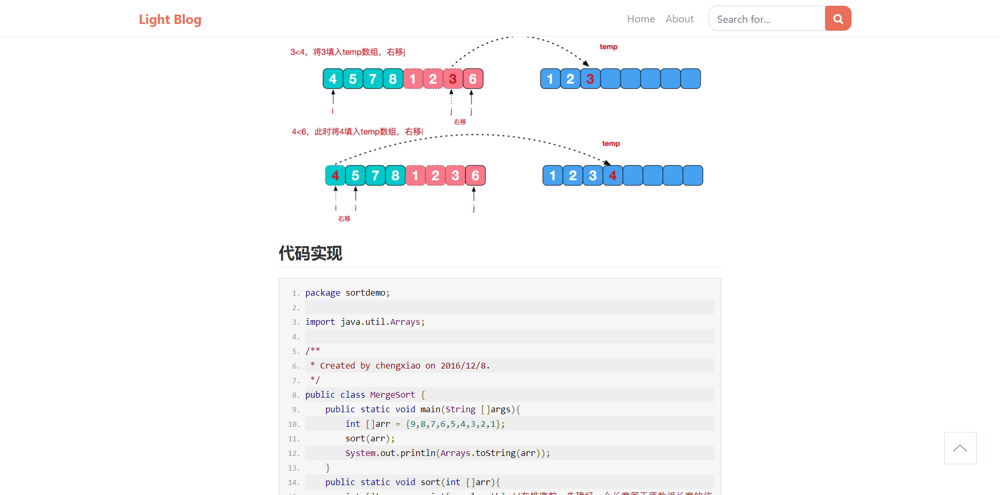
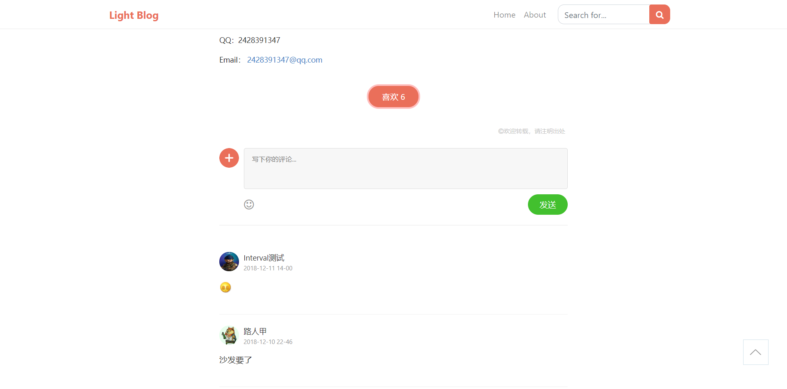

## Light Blog -- 基于ssm的个人博客

### 1. 项目简介

#### 1.1 项目说明

本系统是一个轻量级博客系统，前端页面参考了[简书](http://www.jianshu.com)，后端管理页面使用了一个网上找的EasyUI管理模板，外观简洁、大气，功能少而完备。
由于本博客系统是博主开发的第一个完整的项目，故会存在代码优化、Bug方面的问题，欢迎大家批评指正。

#### 1.2 涉及技术及工具

- 核心框架：SpringMVC、Spring、Mybatis
- 页面框架： EasyUI、Bootstrap
- 富文本编辑器：Editor.md
- 数据库：MySQL
- 项目管理 Maven
- 安全框架 Shiro

### 2. 效果图

#### 2.1 首页

#### 2.2 博客阅读页

#### 2.3 后台

### 3. 构建和运行

#### 3.1 环境要求

- JDK：推荐1.8，1.7应该没问题
- Tomcat：推荐Tomcat8，Tomcat7 也行
- MySQL：5.6及以上

#### 3.2 配置说明

- **注意**：项目运行要求 Application Context 为 **/** ，不要使用默认的项目名作为根路径（可以直接修改Tomcat配置文件，或把项目置于webapps下的ROOT文件夹中，IDEA 用户可以在 Edit Configuration 下 Deployment 中设置 Application Context）
- 要求MySQL编码为**utf8mb4**（评论或文章中可能会出现utf8不包含的字符）
- 新建数据库，导入lightblog.sql, 并修改resources/resource/db.properties
- 如果想修改About页面显示的内容，请修改resources/resource/resource.properties
- 本博客系统使用了 jquery.cookie.js，cookie默认过期时间为浏览器关闭，若您想重新设定cookie有效时长，可到 /static/js/article.js 处进行修改
- 后台登录用户名和密码均为admin

### 4. 联系方式

QQ：2428391347

Email： 2428391347@qq.com
